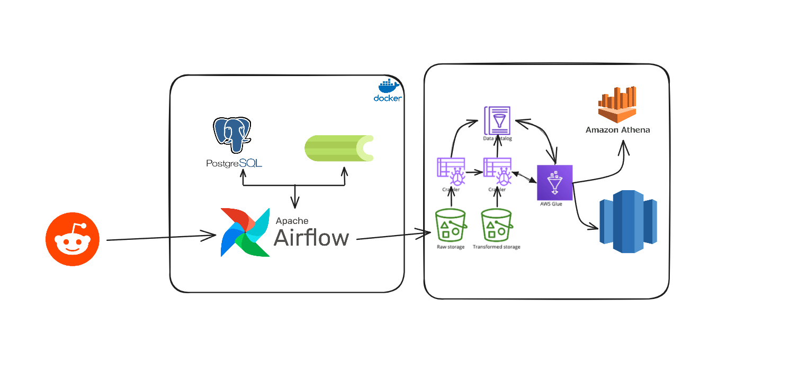
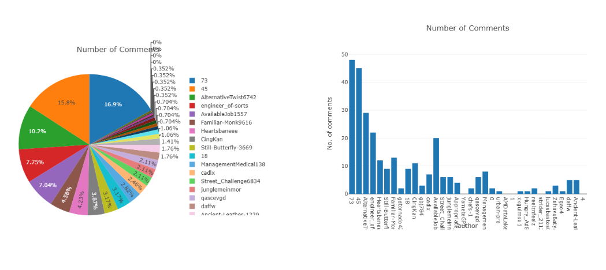

#  Reddit Data Engineering Pipeline

A scalable data pipeline that extracts Reddit posts and comments, stores them in Amazon S3, transforms the data using AWS Glue and Athena, and loads it into Amazon Redshift for analytics — orchestrated with Apache Airflow.

##  Overview

This project builds an end-to-end **data engineering pipeline** that:

- Extracts Reddit data (posts, comments) using the official [Reddit API](https://www.reddit.com/dev/api/). 
- Stores raw JSON data in **Amazon S3**.
- Uses **Apache Airflow** to orchestrate ETL workflows.
- Leverages **AWS Glue** and **Amazon Athena** for schema management and transformations.
- Loads cleaned data into **Amazon Redshift** for querying and visualization.

It's ideal for analyzing trends, sentiment, or user behavior from Reddit communities.

##  Features

- Reddit data ingestion  
- Raw data storage in AWS S3  
- Workflow automation via Apache Airflow  
- Schema management and transformation with AWS Glue & Athena  
- Final data warehouse in Amazon Redshift  
- Dockerized local development environment  

## ️ Architecture Overview

## ️ Technologies Used

| Tool/Service        | Purpose |
|---------------------|---------|
| **Reddit API**      | Source of social media data |
| **Apache Airflow**  | Workflow orchestration |
| **Docker**          | Containerization of services |
| **Amazon S3**       | Raw data storage |
| **AWS Glue**        | Data cataloging and ETL jobs |
| **Amazon Athena**   | Querying and transforming data in S3 |
| **Amazon Redshift** | Final data warehouse for analytics |
| **PostgreSQL**      | Metadata store for Airflow |

##  What can be with this?

* Analyze trending topics across subreddits
* Monitor community growth and engagement
* Perform sentiment analysis on comments
* Build dashboards using tools like QuickSight, Power BI, or Tableau
* Extend the pipeline to include more subreddits or additional data types

## Dashboards

